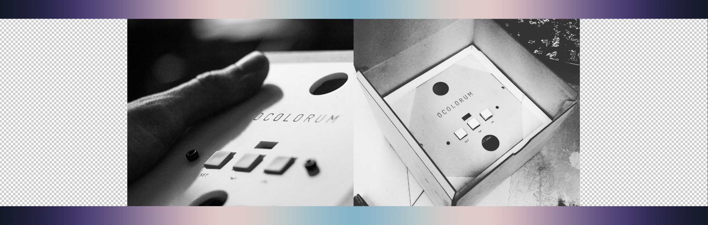

# Ocolorum (wip)
An abstract light clock running on Arduino Uno + RTC Module + NeoPixels as a visual representation of the day/night sky.
I am reorganizing this project (as some other projects) during the COVID-19 pandemic in 2020.
For more information please see the point TO-DO

---

**Hardware**

- Arduino Uno or Attiny85/84 / ESP in the future?
- DS1307, DS32331 rtc module
- NeoPixels or WS2811/WS2812 LEDs (with at least 10 LEDs)

---

**Dependencies**

* Wire.h (ATMega328p) or TinyWireM.h (https://github.com/adafruit/TinyWireM)
* Adafruit_NeoPixel.h
* Analog MultiButton (http://damienclarke.me/code/analog-multi-button)

---

**How does it work?**

A given array of 12 colors represents 11 gradients (in-between) which are gradually tested over the running of a day.

e.g the first gradient starts midnight (0:00) and goes 'til 1:00. the delta between corresponding r, g and b values are being calculated, divided into steps and fed to a resolution of 3600 seconds (per hour). then over time gradually the colors will change almost unnoticably - unless you have a really good eye.

so 0:00 is in the array position 0 and fades into 1, 1:00 is position 1 and goes to position 2 and so on. around noon there is a change where the order gets reversed.

The gradients are abstractions of the colors colors in the sky: *From dusk over high noon until deep dawn*.

---

**TO-DO (necessities + niceties)**
- [ ] implement state machine / FSM
- [ ] define states for FSM
- [ ] set-up via WiFi or Bluetooth LE